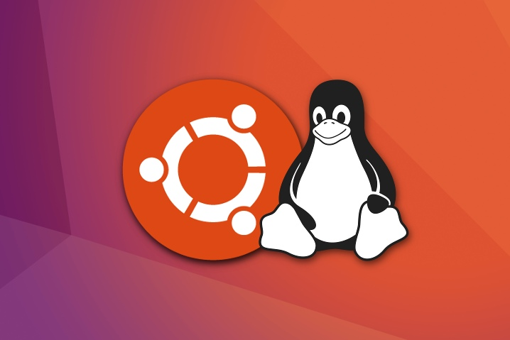

## Comandos Básicos de la Terminal (Unix)
Comando para saber en que directorio estamos ubicados. (Nota: Puedes pensar en los directorios como tus carpetas).
```bash
pwd
```
Para cambiar de directorios (:file_folder:) utilizamos:
```bash
cd
```
Utilizando el comando anterior podemos navegar entre directorios . Por ejemplo, para volver una carpeta hacia atrás utilizamos:
```bash
cd ..
```
Para navegar a un directorio en específico (:open_file_folder:) debemos escribir el nombre de la carpeta.
```bash
cd MiCarpeta
```
Para listar los archivos y directorios (:books:) que existen en el directorio actual, es decir en la carpeta en la que nos encontramos, utilizamos:
```bash
ls
```
Para crear un nuevo directorio dentro del directorio en el que te encuentras (piénsalo como crear una carpeta nueva dentro de la carpeta en la que estás) debes utilizar:
```bash
mkdir nuevaCarpeta
```
Si deseas crear un archivo nuevo en tu directorio debes utilizar el comando:
```bash
touch nuevoarchivo.html
```
Si estas abrumado por el montón de comandos (y, posiblemente, algún que otro error) que aparecen en tu terminal (:sweat:) y quieres limpiar o despejar tu mente y tu pantalla, solamente debes utilizar el comando:
```bash
clear
```
Si tu terminal se pone "lenta" o no responde a tus comandos (:angry:), no te frustres ni cedas ante la ira, prueba utilizar el comando que te permite reiniciar tu terminal:
```bash
reset
```
(:point_right: Nota: Para utilizar el siguiente comando debes tener instalado el editor de texto Visual Studio Code). Para abrir una carpeta o archivo en Visual Studio Code desde tu terminal puedes utilizar el siguiente comando:
```bash
code .
```
Si deseas **borrar** archivos y directorios de forma completa o archivos que requieren permisos especiales.(El comando `sudo` se usa para ejecutar el comando como administrador).

(:warning:*Nota: Todo lo que se elimine con ese comando no se puede recuperar, úsalo con sabiduría*)
```bash
sudo rm archivoejemplo.txt
```
Si estás eliminando archivos o directorios que pertenecen a <u>tu usuario</u> y tienes los permisos adecuados, no necesitas usar sudo. Por ejemplo, si deseas eliminar un archivo en tu directorio personal, puedes simplemente usar:
```bash
rm miarchivo.txt
```
Como un "extra", si quieres eliminar tanto el directorio como todas sus subcarpetas y archivos puedes usar el siguiente comando:
```bash
sudo rm -r /carpetaEjemplo
```
