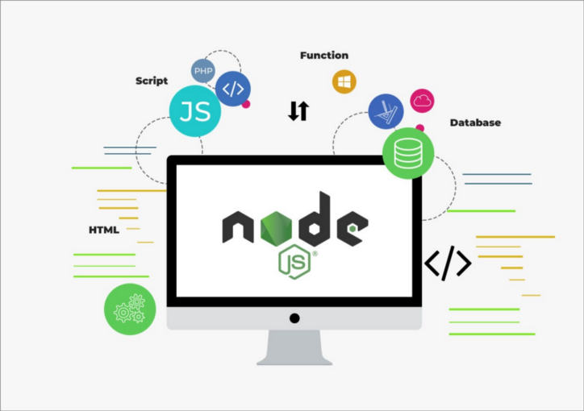

# ¿Qué es Node.js?

Node.js es un entorno de ejecución para JavaScript y permite que puedas usar JavaScript para crear servidores web, trabajar con bases de datos, y construir aplicaciones completas. En otras palabras, <u>te permite usar JavaScript para hacer aplicaciones tanto del lado del servidor (backend), como en el navegador (frontend).</u>

## ¿Por qué instalar Node.js?

Algunas de las razones comunes por las que podrías querer instalar Node.js son:

**Desarrollo de Aplicaciones:** Si estás desarrollando aplicaciones web, especialmente si usas tecnologías como React, Angular, o Vue, Node.js es muy útil porque muchas herramientas de desarrollo y frameworks están basados en él.

**Ejecución de Scripts:** Puedes usar Node.js para ejecutar scripts que realicen tareas automáticas, como procesar archivos, interactuar con APIs, etc.

**Servidor Web:** Puedes usar Node.js para construir servidores web que manejen peticiones y respuestas, similar a cómo funcionan servicios en línea.

**Manejo de Paquetes:** Node.js incluye un gestor de paquetes llamado NPM (Node Package Manager), que te permite instalar y gestionar librerías y herramientas que facilitan el desarrollo :raised_hands:.

## **¿Cómo instalar Node.js desde la terminal?**

A continuación, te mostraremos una guía rápida para instalar Node.js en sistemas basados en UNIX (Linux o Mac):

1. Abre la **Terminal**.

2. Actualiza la lista de paquetes (opcional pero recomendado):

```bash
sudo apt update
```

3. **Instala NVM**.

Ve a las instrucciones para saber cual es la versión más reciente: https://github.com/nvm-sh/nvm?tab=readme-ov-file#installing-and-updating

Necesitas buscar el comando que ejecuta el instalador:

```bash
curl -o- https://raw.githubusercontent.com/nvm-sh/nvm/v0.40.1/install.sh | bash
```

❗ En el momento de escribir estas instrucciones, la versión más reciente de NVM es 0.40.1 pero revisa el comando en la documentación https://github.com/nvm-sh/nvm?tab=readme-ov-file#installing-and-updating

4. **Activar NVM**

Si estás usando `zsh` en la terminal:

```bash
source ~/.zshrc
```

Si no sabes que es `zsh` probablemente no lo estás usando, así que podemos activar NVM en el _shell_ predeterminado en UNIX que es `bash`

```bash
source ~/.bashrc
```

5. **Instalar NodeJS con NVM**

Vamos a instalar siempre la version LTS (_Long Term Support_):

```bash
nvm install --lts
```

6. Verifica la instalación. Puedes comprobar que Node.js y NPM se instalaron correctamente con estos comandos (que también sirven para verificar la versión de **Node.js** y de **NPM** que tienes actualmente):

```bash
node -v
```

```bash
npm -v
```

¡Y eso es todo! Con Node.js y npm instalados, estás listo para empezar a desarrollar aplicaciones y usar herramientas modernas basadas en JavaScript. :clap::clap::clap:

Mucha suerte en tu viaje. :rocket::milky_way:
